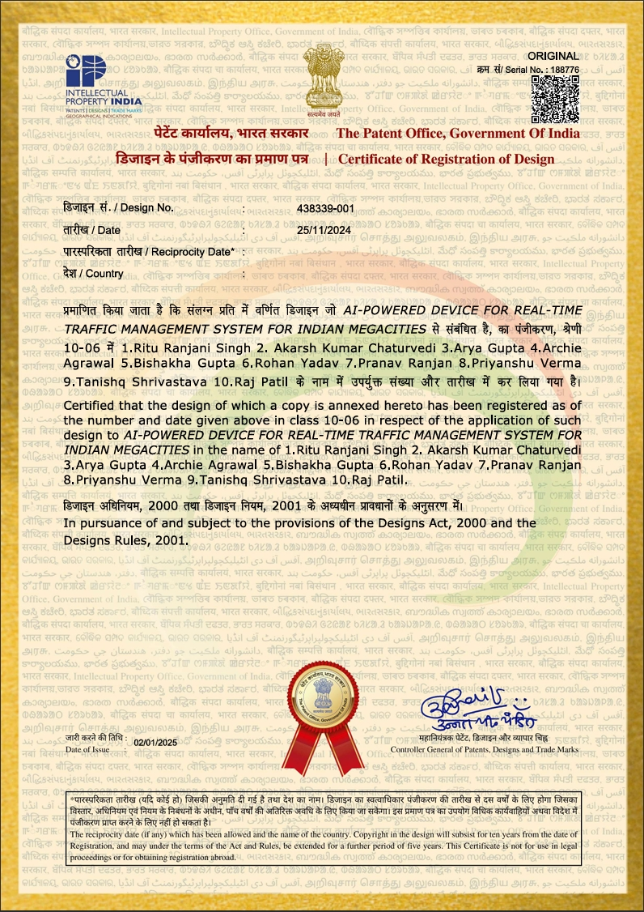

## 🚀 Getting Started

### Prerequisites

- Python 3.x
- Nodejs
- OpenCV
- YOLOv4 weights and configuration files
- Required Python packages (listed in requirements.txt)

## 💻 Local Setup

Clone the repository:

```bash
git clone https://github.com/ashish0kumar/AI Based Traffic Management.git
cd AI Based Traffic Management
```

Start the backend server:

```bash
cd backend
environments\Scripts\activate
python app.py
```

Start the frontend server:
```bash
cd frontend
npm install
npm start
```

Upload Traffic Videos: <br/>
Use the web interface to upload 4 traffic videos. The system will process the videos and display optimized green light times based on the analysis.

# AI Based Traffic Management
An AI based traffic management system with real-time monitoring

## 📸 Certficate


## 🗒️ Overview

The invention relates to an AI-powered device designed for real-time traffic 
management in Indian megacities. The device utilizes advanced machine learning 
algorithms and sensor technology to monitor, analyze, and optimize traffic flow on 
urban roads. By integrating real-time data from traffic cameras, GPS sensors, and 
vehicles, the device predicts traffic congestion, detects accidents, and provides 
dynamic traffic signals and route recommendations. This system enhances the 
efficiency of urban traffic management, reduces travel time, and minimizes 
congestion-related pollution, offering a smart and sustainable solution for the 
growing urban transportation challenges in Indian megacities.

## 📸 Certficate

<br/><br/>
<br/><br/>


## ✨ Technical Working in Detail

The AI-powered traffic management device integrates multiple components to 
monitor, analyze, and manage traffic flow in real-time. The device functions as 
follows:

- 1. Data Collection through Sensors and Cameras: The device is equipped 
with various sensors, including cameras (high-definition, infrared, and 
thermal), GPS sensors, and traffic flow sensors installed at key intersections, 
highways, and busy urban routes. These sensors collect data on vehicle 
counts, speeds, traffic density, accidents, and environmental conditions.

- 2. Real-time Data Transmission: The collected data is transmitted in real
time to a central AI-powered traffic management system. The system 
continuously receives updates from traffic sensors and other sources, such as 
GPS data from public transportation vehicles and individual mobile 
applications. The integration of Internet of Things (IoT) technology ensures 
seamless communication between devices and the central system.

- 3. Machine Learning Algorithms for Traffic Prediction: The AI system 
processes the real-time data using machine learning algorithms, such as deep 
learning and reinforcement learning. The system is trained on historical 
traffic data and traffic patterns specific to Indian megacities, learning to 
predict future traffic conditions and identify potential congestion points 
before they occur. It can also detect anomalies such as accidents, road 
closures, or sudden traffic surges.

- 4. Dynamic Traffic Signal Control: Based on the analysis, the AI system 
adjusts traffic signals in real-time to optimize the flow of traffic. The system 
dynamically changes the timing of traffic lights depending on vehicle 
density, reducing waiting times and ensuring smooth movement of vehicles. 
The AI can also prioritize emergency vehicles, public transport, or high
traffic routes as needed. 
- 5. Route Optimization and Navigation: The AI device also provides real
time route recommendations to drivers via mobile apps or GPS navigation 
systems. It suggests the fastest routes based on current traffic conditions, 
helping reduce congestion on heavily trafficked roads. This dynamic route 
optimization minimizes travel times and ensures better distribution of traffic 
across different routes. 
- 6. Accident and Incident Detection: The system can detect accidents or 
incidents based on unusual patterns in traffic flow or reports from sensors. It 
immediately alerts traffic management authorities and nearby drivers, while 
also adjusting traffic signals to divert traffic away from accident zones. The 
system ensures that emergency response teams can reach the site quickly and 
efficiently. 
- 7. Environmental and Pollution Monitoring: The device incorporates 
environmental sensors to monitor air quality and pollution levels in real 
time. Based on traffic patterns and congestion data, the system can suggest 
changes to traffic flow to minimize pollution in high-congestion areas, 
contributing to better air quality in urban environments. 
- 8. User Interface and Reporting: The traffic management system includes a 
user interface for traffic authorities, where real-time traffic reports, 
congestion data, and incident alerts are displayed on a dashboard. 
Authorities can monitor the traffic conditions at various locations, control 
traffic signals, and make adjustments as necessary. Additionally, the system 
generates analytics reports, including trends in traffic patterns, accident 
hotspots, and pollution data.

## ✨ Advantages
- 1. Real-time Traffic Optimization: The AI-powered device continuously 
analyzes and adjusts traffic flow in real-time, optimizing the movement of 
vehicles and reducing congestion, especially during peak hours. This 
dynamic management improves traffic efficiency and minimizes delays. 

- 2. Enhanced Traffic Safety: By detecting accidents and incidents quickly, the 
system helps reduce response times for emergency services. The automatic 
rerouting of traffic away from accident-prone zones reduces the risk of 
secondary accidents and ensures smoother emergency evacuations. 

- 3. Sustainability and Pollution Reduction: The system’s ability to optimize 
traffic flow also leads to reduced fuel consumption and lower emissions. The 
device promotes sustainable urban transportation by decreasing idling time 
and minimizing unnecessary vehicle congestion, ultimately improving air 
quality in megacities. 

- 4. Scalability and Customization: The system can be easily scaled to 
accommodate the growing population and transportation needs of Indian 
megacities. The AI model can be trained on local traffic data, enabling it to 
adapt to the specific challenges of each city. It can be applied to various 
types of roads, intersections, and urban settings. 

- 5. Reduced Travel Time and Cost: By providing real-time route optimization 
and intelligent traffic signal adjustments, the device helps reduce overall 
travel time for commuters. This leads to lower fuel consumption, cost 
savings for drivers, and improved productivity for the workforce. 

- 6. Improved Public Transport Efficiency: The system can prioritize buses 
and other public transport vehicles, ensuring timely arrivals and departures. 
This improves the efficiency of public transport systems and encourages 
more people to rely on eco-friendly travel options. 

- 7. Increased Convenience for Drivers: The real-time traffic updates and route 
suggestions help drivers avoid congested areas and make better-informed 
decisions about their journeys. This leads to less frustration, faster 
commutes, and a more pleasant driving experience.


## 🙏 Acknowledgments

- YOLOv4: For vehicle detection.
- OpenCV: For video processing.
- Genetic Algorithm: For optimizing traffic light timings.
